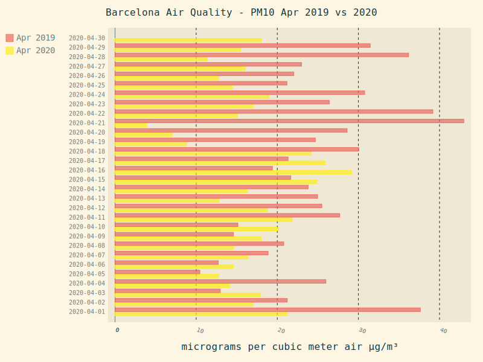

Barcelona Air Quality - Covid19 Lockdown effect
-----------------------------------------------

Using the data from https://opendata-ajuntament.barcelona.cat/data/en/dataset/qualitat-aire-detall-bcn create graphs to show the effect of the state of the alarm and general lock down that started March 15th 2020 due to Covid19 pandemic.

### Overview of all available pollutant data using January to December 2020 data.

### Comparisons between April 2019 and April 2020 for NO2

### Comparisons between April 2019 and April 2020 for PM10

## Running the code

1. git clone
2. pipenv install
3. pipenv run python airquality.py